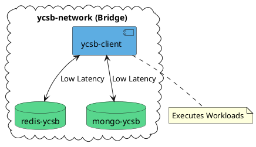

# Application Architecture

This document outlines the architecture, infrastructure, and data flow of the YCSB Benchmark Application. The system is designed to automate, visualize, and control YCSB (Yahoo! Cloud Serving Benchmark) tests against Redis and MongoDB databases.

## 1. High-Level Overview

The application follows a **3-tier architecture** wrapped in a containerized environment:

1.  **Frontend Layer**: Next.js application for user interaction.
2.  **Backend Layer**: Node.js/Express API for orchestration and data processing.
3.  **Infrastructure/Benchmark Layer**: Docker containers hosting the databases (Redis, MongoDB) and the YCSB client runner.

## 2. Infrastructure & Communication

The entire system is orchestrator using **Docker Compose**.

### Network: `ycsb-network`

All containers involved in the benchmark process run within a dedicated **bridge** Docker network named `ycsb-network`. This private network facilitates low-latency communication between components while preventing unintended interference from external services.

The following services are connected to this network:

- **ycsb-client** – executes YCSB workloads.
- **redis-ycsb** – the Redis database instance.
- **mongo-ycsb** – the MongoDB database instance.

### Components

- **Frontend (Host Machine)**: Runs on port `3000`. Communicates with the Backend API via HTTP.
- **Backend (Host Machine)**: Runs on port `8000`.
  - Communicates with the Docker daemon to execute commands inside containers.
  - Reads shared files from the host filesystem.
- **Databases (Docker)**:
  - Redis mapped to host `6379`.
  - MongoDB mapped to host `27017`.

### Data Persistence (Volumes)

Two host directories are mounted into the `ycsb-client` container to ensure data persistence and sharing:

- `./results` ↔ `/ycsb/results`: Stores raw benchmark logs and the parsed `benchmark_summary.csv`.
- `./scripts` ↔ `/ycsb/scripts`: Contains execution scripts (`run_all_benchmarks.sh`) and analysis tools (`analyze_results.py`).

---

## 3. Frontend Layer (Next.js)

The frontend is built with **Next.js** and **React**. It serves as the control panel and visualization dashboard.

### Key Responsibilities:

- **Control**: Allows the user to trigger the full benchmark suite via a generic "Start" button.
- **Feedback**: Displays real-time status updates (e.g., "Running Workload A on Redis", "Loading Data") by polling the backend.
- **Visualization**: Fetches parsed CSV data and renders it as interactive charts (likely using libraries like Recharts or Chart.js) and summary statistics.
- **Dashboard**: Provides a unified view of throughput, latency, and operation status for both databases.

### Key Components:

- **Dashboard Feature**: Orchestrates the view of current benchmark status.
- **YCSB Results Feature**: Specialized components for rendering the specific metrics output by YCSB (Average Latency, Throughput ops/sec).

---

## 4. Backend Layer (Node API)

The backend is an **Express.js** application acting as the bridge between the UI and the Docker infrastructure.

### Key Responsibilities:

1.  **API Endpoints**:

    - `POST /api/benchmark/start`: Initiates the benchmark process.
    - `GET /api/benchmark/status`: Returns current progress (Workload A-F, Database, Step) to the frontend.
    - `GET /api/results`: Reads and parses the `benchmark_summary.csv` file to JSON for the frontend.
    - `GET /api/check-connection`: Verifies connectivity to the database services.

2.  **Process Management**:

    - It does **not** run the benchmark itself. Instead, it spawns a child process on the host machine.
    - It executes: `docker-compose exec -T ycsb bash -c "..."`.
    - This allows the Node.js app to control the isolated `ycsb-client` container.

3.  **Real-time Parsing**:
    - The service attaches listeners to the `stdout` of the Docker command.
    - It regex-matches the output (e.g., `Running workload a`) to update the internal state machine (`benchmarkStatus`), giving the frontend granular progress updates without needing a complex socket connection.

---

## 5. Databases & YCSB Layer (Benchmarking)

This layer is purely containerized and isolated.

### The `ycsb-client` Container

- **Role**: The "Driver". It contains the Java runtime and the YCSB binaries.
- **Execution Flow**:
  1.  Receives command from Backend.
  2.  Executes `./scripts/run_all_benchmarks.sh`.
  3.  **Sequential Execution**:
      - Resets Redis/Mongo state (flushes DBs).
      - Type `LOAD`: Inserts initial dataset (Workload A).
      - Type `RUN`: Executes specific workload logic (A-F).
  4.  **Logging**: Writes raw text output to `/ycsb/results/redis` or `/ycsb/results/mongodb`.
  5.  **Analysis**: Runs `analyze_results.py` post-execution to aggregate all text files into a single `benchmark_summary.csv`.

### Databases

- **Redis**: Serves as a key-value store target.
- **MongoDB**: Serves as a document store target.
- Both are reset between workloads to ensure "clean slate" performance metrics.

---

## Data Flow Summary

1. **User** clicks "Start" on Frontend.
2. **Frontend** calls `POST /api/benchmark/start`.
3. **Backend** runs `docker-compose exec ... run_all_benchmarks.sh`.
4. **YCSB Container** runs workloads against **Redis** and **Mongo**.
5. **YCSB Container** saves logs to `./results` (Host Volume).
6. **YCSB Container** runs python script to generate `benchmark_summary.csv` in `./results`.
7. **Frontend** polls `GET /api/results`.
8. **Backend** reads `benchmark_summary.csv` from disk and returns JSON.
9. **Frontend** renders graphs.

---

## 6. Interfața Utilizatorului (Front-end)

Aplicația oferă o interfață intuitivă pentru gestionarea și vizualizarea benchmark-urilor.

### Ecranul Home

Ecranul principal ("Home") servește ca punct central de control și monitorizare. Acesta include:

1.  **Cardul de Status YCSB**:

    - **Stare Rezultate**: Indică vizual (Verde/Galben) dacă există rezultate disponibile pentru vizualizare.
    - **Conexiuni Baze de Date**: Monitorizează în timp real starea containerelor Redis și MongoDB (Running/Stopped).
    - **Acțiuni**:
      - **Start Benchmark**: Inițiază rularea completă a suitei de teste YCSB.
      - **Go to Dashboard**: Navighează către pagina de rezultate detaliate (activ doar dacă există date).
      - **Check Status**: Verifică manual conectivitatea la bazele de date.

2.  **Panou de Progres** (Vizibil doar în timpul execuției):

    - Apare automat când un benchmark este pornit.
    - Afișează etapa curentă (ex: "Inside container", "Running Workload A on Redis") și progresul procentual estimat.

3.  **Cardul SQL Benchmark**:
    - Un placeholder pentru viitoarele extensii ale aplicației, dedicat testelor SQL.

### Ecranul YCSB Dashboard

Acest ecran este centrul de analiză detaliată a performanței, oferind instrumente avansate de filtrare, vizualizare și interpretare a datelor colectate.

#### 1. Configurare și Control (Filtrare)

Utilizatorul are control deplin asupra modului în care datele sunt afișate, permițând comparații specifice prin intermediul componentelor de interfață:

- **Selectare Metrică**: Un meniu dropdown ("Select") permite alegerea indicatorului de performanță dorit dintr-o listă exhaustivă. Opțiunile includ:
  - **Throughput**: Numărul total de operații pe secundă (ops/sec).
  - **Latență Medie (Average)**: Timpul mediu de răspuns pentru operații de Read, Update, Insert sau Scan.
  - **Latență Percentilă (P95, P99)**: Măsurători critice pentru analiza cozilor de distribuție (tail latency), disponibile pentru toate tipurile de operații.
- **Selectare Multiplă Workload-uri**: Permite utilizatorului să includă sau să excludă din analiză oricare dintre cele 6 workload-uri standard YCSB, oferind flexibilitate în vizualizare.
- **Tip Grafic**: Comutator pentru schimbarea modului de vizualizare între:
  - **Bar Chart**: Pentru comparații directe, side-by-side.
  - **Line Chart**: Pentru vizualizarea tendințelor.

#### 2. Vizualizarea Rezultatelor

Rezultatele sunt prezentate într-un mod clar și agregat:

- **Grafic Principal**: Randat dinamic pe baza filtrelor aplicate, acesta compară performanța Redis vs. MongoDB.
- **Carduri Sumare (Statistics)**: Această secțiune agregă datele vizibile pentru a oferi o imagine de ansamblu rapidă:
  - Calculează **Media**, **Minimul** și **Maximul** valorilor pentru metrica selectată.
  - Determină automat **"Câștigătorul"** (Winner): Compară mediile celor două baze de date și evidențiază câștigătorul pe baza logicii metricii (ex: valori mari pentru Throughput, valori mici pentru Latență).

#### 3. Secțiunea de Informații (Explicații)

Pentru a facilita interpretarea corectă a datelor, dashboard-ul include o secțiune educativă extensivă:

- **Workloads Tab**: Detaliază compoziția fiecărui workload YCSB:
  - _Workload A (Update Heavy)_: 50/50 Read/Update.
  - _Workload B (Read Heavy)_: 95/5 Read/Update.
  - _Workload C (Read Only)_: 100% Read.
  - _Workload D (Read Latest)_: Inserare date noi și citirea celor mai recente.
  - _Workload E (Scan Heavy)_: Scanări de intervale scurte.
  - _Workload F (Read-Modify-Write)_: Tranzacții atomice de modificare.
- **Metrics Tab**: Oferă definiții tehnice și ghiduri de interpretare pentru fiecare metrică disponibilă (ex: explică diferența dintre latența medie și P99).
