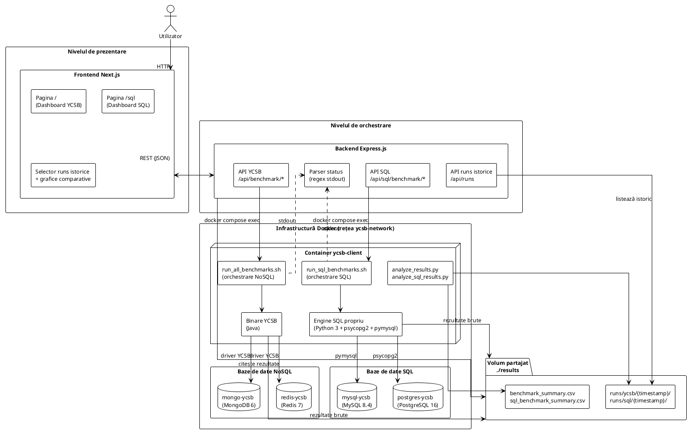
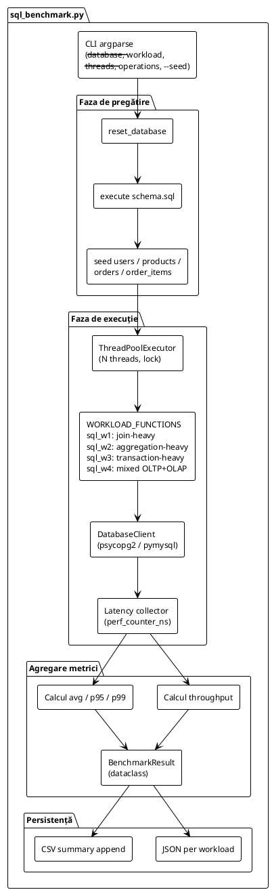
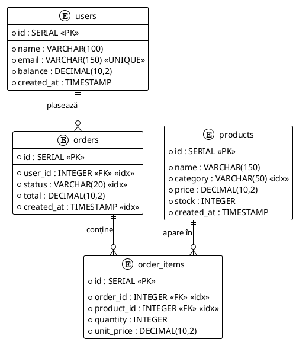

# CAPITOLUL 4. STUDIU DE CAZ

După ce în capitolele anterioare au fost prezentate metodele tradiționale și moderne de evaluare a performanței bazelor de date, precum și o analiză teoretică aprofundată a benchmark-urilor standardizate și a celor emergente (precum YCSB), acest capitol își propune să transpună conceptele discutate într-un cadru practic și aplicabil.

Prin realizarea unui studiu de caz concret, ce constă în dezvoltarea unei aplicații integrate de benchmarking, se urmărește evaluarea performanței reale a patru sisteme de stocare reprezentative — Redis, MongoDB, PostgreSQL și MySQL — în condiții controlate, relevante pentru arhitecturi cloud-native și aplicații web moderne. Aplicația dezvoltată cuprinde două module funcționale complementare, care împart aceeași arhitectură și infrastructură, dar acoperă spații tehnologice diferite: un modul YCSB pentru evaluarea bazelor de date NoSQL (Redis, MongoDB) și un modul SQL pentru evaluarea bazelor de date relaționale (PostgreSQL, MySQL), cel din urmă bazat pe un engine de benchmark dezvoltat propriu.

Această componentă experimentală are rolul de a valida importanța metodelor moderne de evaluare și de a evidenția diferențele de comportament între sisteme cu paradigme diverse — in-memory key-value store, document-based NoSQL, relațional orientat OLTP și relațional orientat web — într-un cadru unitar și comparabil.

## 4.1 Arhitectura generală a aplicației

Această secțiune prezintă arhitectura aplicației dezvoltate, configurația infrastructurii și rolurile funcționale ale fiecărui nivel. Aplicația are ca obiectiv automatizarea, coordonarea și prezentarea vizuală a evaluărilor de performanță pentru cele patru sisteme de baze de date evaluate, indiferent de modulul activ. Un accent deosebit este pus pe asigurarea reproductibilității experimentelor, izolarea mediului de execuție și transparența rezultatelor, aspecte esențiale pentru realizarea unei analize riguroase a performanțelor.

Sistemul propus urmează un model arhitectural pe trei niveluri, fiind implementat într-o infrastructură containerizată. Această alegere arhitecturală permite obținerea unui grad ridicat de modularitate, scalabilitate și control asupra condițiilor experimentale. Separarea responsabilităților garantează faptul că modificările realizate într-un nivel (de exemplu, la nivel de vizualizare sau de logică de benchmark) nu afectează în mod direct celelalte componente, contribuind astfel la mentenanța și modularitatea sistemului (fig. 10).

Toate serviciile interne sunt conectate la o rețea Docker privată de tip bridge, denumită `ycsb-network`. Această rețea facilitează comunicarea cu latență redusă între componente, prevenind în același timp interferențele neintenționate din partea serviciilor externe. Serviciile interne conectate la rețea sunt:

- `ycsb-client` — containerul principal de execuție, care găzduiește atât binarele YCSB pentru modulul NoSQL, cât și engine-ul propriu de SQL;
- `redis-ycsb` — instanța bazei de date Redis;
- `mongo-ycsb` — instanța bazei de date MongoDB;
- `postgres-ycsb` — instanța bazei de date PostgreSQL;
- `mysql-ycsb` — instanța bazei de date MySQL.

Persistența și accesul la date sunt realizate prin volume Docker partajate, care permit stocarea rezultatelor și a scripturilor de analiză în afara containerelor. Astfel, datele generate de benchmark-uri pot fi procesate direct de aplicația backend, fără operațiuni suplimentare de transfer, contribuind la eficiența și claritatea fluxului experimental. Volumul partajat `./results` este reutilizat de ambele module, oferind un punct central de agregare a rezultatelor experimentale.

— aici trebuie să introduci diagrama plantuml (Fig. 10 — Diagrama arhitecturală generală a aplicației) —



### 4.1.1 Nivelul frontend

Nivelul de prezentare al aplicației (frontend) este realizat cu ajutorul framework-ului Next.js, utilizând paradigma React bazată pe componente pentru construirea interfeței grafice. Acest nivel constituie punctul principal de interacțiune cu utilizatorul, îndeplinind simultan funcții de orchestrare a execuției benchmark-urilor și de analiză vizuală a rezultatelor obținute. Cele două module sunt expuse prin pagini dedicate (pagina principală pentru modulul YCSB și pagina `/sql` pentru modulul SQL), care urmează aceeași paradigmă de componente reutilizabile.

Din punct de vedere funcțional, aplicația frontend permite declanșarea controlată a benchmark-urilor, oferind în același timp mecanisme de monitorizare în timp real a progresului acestora. Starea execuției este actualizată periodic prin intermediul apelurilor REST către serviciul backend, asigurând o vizibilitate continuă asupra etapelor de testare, fără a necesita conexiuni persistente de tip websocket. Datele sunt prefetch-uite server-side cu React Query, ceea ce asigură un timp de încărcare optim la deschiderea paginilor și o gestionare unitară a cache-ului între rulări.

Rezultatele benchmark-urilor sunt prezentate sub formă de grafice și tabele interactive, care evidențiază metrici esențiale precum debitul de operații și latențele caracteristice. În plus, interfața permite realizarea unei analize comparative între bazele de date evaluate într-un cadru unitar, facilitând evaluarea diferențelor de comportament în funcție de tipul de workload utilizat. Fiecare modul beneficiază de un selector de runs istorice, alimentat din endpoint-ul `/api/runs`, care permite revizitarea rezultatelor unor rulări anterioare fără a pierde istoricul experimental.

### 4.1.2 Serviciul backend

Backend-ul aplicației este realizat sub forma unui serviciu Express.js, având rolul de componentă principală de coordonare a sistemului. Acesta mediază interacțiunea dintre frontend și infrastructura containerizată, fiind responsabil de declanșarea experimentelor, monitorizarea execuției și furnizarea rezultatelor către interfața grafică. Interfața backend expune un set clar delimitat de servicii REST, concepute pentru a acoperi funcționalitățile esențiale ale aplicației pentru ambele module:

- declanșarea execuției unei rulări (`POST /api/benchmark/start` pentru YCSB, `POST /api/sql/benchmark/start` pentru SQL);
- interogarea stării curente a procesului de evaluare (`GET /api/benchmark/status`, `GET /api/sql/benchmark/status`);
- accesul la rezultatele agregate (`GET /api/results`, `GET /api/sql/results`);
- accesul la istoricul rulărilor (`GET /api/runs?module=<ycsb|sql>`);
- verificarea conectivității către sistemele de baze de date evaluate, asigurând validitatea mediului experimental înainte de rularea testelor.

Din punct de vedere operațional, backend-ul adoptă o strategie de orchestrare indirectă a benchmark-urilor, evitând rularea directă a logicii de testare în cadrul aplicației. În schimb, execuția este delegată către un proces separat la nivelul sistemului gazdă, care controlează mediul Docker responsabil de rularea containerului `ycsb-client`. Această abordare contribuie la menținerea separării responsabilităților, la izolarea mediului de testare și la creșterea reproductibilității experimentelor.

Pe parcursul unei rulări, stdout-ul scripturilor de orchestrare este parsat în timp real cu expresii regulate, pentru a actualiza un obiect global de status fără overhead-ul unei conexiuni persistente. Această abordare permite frontend-ului să afișeze un indicator de progres granular prin simple apeluri REST periodice, păstrând o arhitectură backend simplă, fără dependențe suplimentare de socket-uri sau evenimente push (fig. 12).

## 4.2 Setup-ul experimental

Pentru a asigura un mediu de testare controlat și ușor de replicat, s-a optat pentru utilizarea tehnologiei Docker în vederea configurării celor patru baze de date evaluate. Alegerea unei arhitecturi containerizate oferă o modularizare clară a componentelor, izolare completă între servicii și eliminarea dependențelor locale de sistemul de operare gazdă. Etapele realizării setup-ului sunt următoarele:

**1. Inițializarea structurii de proiect.** A fost creat un director dedicat experimentului, denumit `benchmark-app`, care servește drept spațiu de lucru pentru toate componentele aplicației:

```bash
mkdir benchmark-app
cd benchmark-app
code .
```

Directorul a fost deschis în Visual Studio Code pentru o gestionare eficientă a fișierelor și editarea configurațiilor.

**2. Crearea fișierului de orchestrare Docker.** În cadrul directorului de proiect a fost definit un fișier `docker-compose.yml`, responsabil de configurarea și lansarea celor cinci containere necesare: patru pentru bazele de date evaluate (Redis 7, MongoDB 6, PostgreSQL 16, MySQL 8.4) și unul pentru clientul de execuție (`ycsb-client`), construit dintr-o imagine personalizată local prin `Dockerfile.ycsb`. Containerele bazelor de date sunt denumite `redis-ycsb`, `mongo-ycsb`, `postgres-ycsb` și `mysql-ycsb`, iar pentru ultimele două sunt definite și volume Docker dedicate (`postgres-data`, `mysql-data`) pentru persistența datelor. Toate cele cinci containere sunt conectate la rețeaua privată `ycsb-network`, iar containerul `ycsb-client` are acces partajat la două volume locale: `./results` pentru salvarea rezultatelor experimentale și `./scripts` pentru scripturile de automatizare.

**3. Construirea imaginii pentru clientul de execuție.** Imaginea folosită de `ycsb-client` este construită local și include atât mediul de execuție Java necesar pentru binarele YCSB, cât și mediul Python 3 cu driverele `psycopg2-binary` și `pymysql` pentru engine-ul SQL propriu. Reconstrucția imaginii se face cu:

```bash
docker compose build --no-cache
```

**4. Pornirea serviciilor.** După asigurarea faptului că aplicația Docker este activă pe sistemul gazdă, serviciile au fost lansate în fundal utilizând comanda:

```bash
docker compose up -d
```

Această comandă descarcă automat imaginile necesare (dacă nu există deja local) și pornește cele cinci containere în mod detașat.

**5. Verificarea funcționării containerelor.** Funcționarea corectă a serviciilor a fost verificată prin intermediul comenzii `docker ps` (fig. 14).

**6. Testarea conexiunii la bazele de date.** Pentru a confirma faptul că serviciile rulează corect și pot primi conexiuni, s-au executat comenzile (fig. 15):

```bash
docker exec -it redis-ycsb redis-cli ping            # Output așteptat: PONG
docker exec -it mongo-ycsb mongosh                    # Output așteptat: shell mongosh
docker exec -it postgres-ycsb psql -U ycsb -d ycsb -c "SELECT version();"
docker exec -it mysql-ycsb mysql -uycsb -pycsb ycsb -e "SELECT VERSION();"
```

În urma acestor pași, cele patru sisteme de baze de date au fost configurate și lansate cu succes într-un mediu containerizat, izolat de gazdă. Acest setup constituie infrastructura de bază pe care vor fi aplicate cele două module de benchmark prezentate în secțiunile următoare, asigurând consistență între rulări și control complet asupra configurațiilor experimentale.

## 4.3 Modulul YCSB

Primul modul al aplicației implementează un benchmark NoSQL bazat pe instrumentul standardizat Yahoo! Cloud Serving Benchmark (YCSB), aplicat pe două sisteme reprezentative cu paradigme diferite: Redis (in-memory key-value store) și MongoDB (document-based NoSQL).

### 4.3.1 Obiectivele testării

Testarea experimentală realizată în cadrul modulului YCSB urmărește evaluarea comparativă a performanței celor două sisteme NoSQL menționate, utilizând YCSB ca instrument standardizat și extensibil. Obiectivele concrete ale experimentului sunt:

- Evaluarea performanței sub workload-uri realiste, care simulează operațiuni frecvente în aplicațiile cloud-native (citiri masive, actualizări concurente, scrieri recente etc.);
- Măsurarea metricilor cheie: latență medie, p95, p99 și throughput (operații/secundă), precum și comportamentul sistemelor sub sarcină constantă;
- Compararea capacității de scalare și a optimizărilor interne pentru două paradigme diferite — Redis, orientat pe viteză maximă și latență minimă, respectiv MongoDB, cu stocare persistentă și suport pentru interogări complexe și replicare;
- Aplicarea metodologiei YCSB (Tier 1 — performanță și, opțional, Tier 2 — scalabilitate), într-un setup controlat, reproductibil și relevant;
- Identificarea avantajelor și limitărilor fiecărui sistem, în funcție de tipul sarcinii de lucru și de caracteristicile arhitecturale.

Scopul general al modulului YCSB este de a oferi o demonstrație practică a modului în care benchmark-urile moderne pot fi utilizate pentru a lua decizii informate în alegerea infrastructurii de stocare, în special în contextul aplicațiilor distribuite, scalabile și centrate pe performanță.

### 4.3.2 Clientul YCSB, bazele de date și workload-urile

Containerul `ycsb-client` servește, pentru acest modul, drept componentă principală pentru rularea benchmark-urilor, integrând mediul de execuție Java, binarele YCSB și scripturi customizate pentru orchestrarea testelor și analiza rezultatelor. Bazele de date evaluate de modul sunt accesate prin driverele oficiale YCSB pentru Redis și MongoDB, iar resetarea completă a instanțelor înainte de fiecare workload asigură reproductibilitatea testelor și previne contaminarea rezultatelor cu date reziduale, garantând astfel integritatea și consistența măsurătorilor de performanță (fig. 13).

Scripturile aferente modulului automatizează întregul proces de testare pentru ambele baze de date, folosind setul standardizat de șase workload-uri YCSB (A–F). Fiecare workload are un profil diferit de operații (raport read/write), fiind conceput pentru a testa diverse scenarii reale: A (50/50 read–update, sarcină mixtă), B (95/5 read-heavy), C (read-only), D (read-latest), E (range scans) și F (read-modify-write). Parametrii experimentali sunt centralizați în Tabelul 4.1.

**Tabelul 4.1 Parametrii experimentali ai modulului YCSB**

| RECORD_COUNT | OPERATION_COUNT | THREADS |
|---|---|---|
| 100.000 | 100.000 | 10 |

### 4.3.3 Fluxul de execuție al modulului YCSB

Fluxul de execuție al scriptului `run_all_benchmarks.sh`, executat în interiorul containerului `ycsb-client`, este următorul:

1. **Așteptarea inițializării Redis/MongoDB** — scriptul verifică în mod repetat dacă serviciile sunt active pe porturile 6379 (Redis) și 27017 (MongoDB), folosind utilitarul `nc` (netcat).
2. **Configurarea parametrilor experimentali** — sunt preluate valorile `RECORD_COUNT`, `OPERATION_COUNT` și `THREADS`.
3. **Crearea directoarelor de rezultate** — `/ycsb/results/redis/` și `/ycsb/results/mongodb/`.
4. **Iterarea prin fiecare workload (a până la f)** — pentru fiecare workload se execută:
   - **Faza de încărcare (load)** — populează baza de date cu datele generate, conform parametrului `RECORD_COUNT`;
   - **Faza de rulare (run)** — execută operațiile simulate conform profilului workload-ului, conform parametrului `OPERATION_COUNT`.

   Rezultatele fiecărei etape sunt salvate în fișiere `.txt` distincte, în funcție de baza de date și workload.

La final, un script de analiză consolidează datele brute într-un fișier agregat `benchmark_summary.csv`, facilitând consumul de către frontend (fig. 16):

- utilizatorul inițiază rularea benchmark-ului din interfața frontend;
- frontend-ul trimite o cerere către endpoint-ul `POST /api/benchmark/start`;
- backend-ul declanșează execuția YCSB prin intermediul `docker compose exec`;
- clientul YCSB rulează workload-urile asupra bazelor de date Redis și MongoDB;
- fișierele brute de log sunt stocate în volumul partajat dedicat rezultatelor;
- rezultatele agregate sunt generate în fișierul `benchmark_summary.csv`;
- frontend-ul interoghează periodic backend-ul prin `GET /api/results` pentru actualizarea datelor;
- backend-ul parsează fișierul CSV și returnează date structurate în format JSON;
- frontend-ul afișează grafice comparative și statistici pentru interpretarea performanțelor (fig. 11).

Automatizarea procesului de testare prin acest flux (Configurare → Execuție → Colectare → Analiză) este esențială pentru a asigura repetabilitatea și acuratețea măsurătorilor de performanță. Fără acest sistem automatizat, ar fi fost necesară rularea manuală a comenzilor în terminal, repartizarea fișierelor cu rezultate, importarea acestora în Excel și analiza separată prin intermediul graficelor. Prin acest flux, totul devine un proces de tip „one-click”, în care singura sarcină a utilizatorului este interpretarea concluziilor finale.

## 4.4 Modulul SQL

Al doilea modul al aplicației extinde cadrul experimental dincolo de spațiul NoSQL evaluat în 4.3, abordând bazele de date relaționale. Întrucât YCSB acoperă, prin design, doar workload-uri simple de tip key–value, evaluarea bazelor de date SQL necesită un engine propriu, capabil să simuleze sarcini reprezentative pentru aplicații moderne — join-uri multi-tabel, agregări analitice, tranzacții ACID și combinații OLTP+OLAP — pe o schemă relațională realistă. Acest modul propune o astfel de soluție și o aplică pe PostgreSQL 16 și MySQL 8.4, două sisteme reprezentative pentru ecosistemul SQL.

### 4.4.1 Obiectivele testării

Testarea experimentală a modulului SQL urmărește evaluarea comparativă a două sisteme moderne de baze de date relaționale, utilizând un engine de benchmark propriu, dezvoltat special pentru acest studiu. Obiectivele concrete ale experimentului sunt:

- **Evaluarea comparativă** a PostgreSQL 16 și MySQL 8.4 sub workload-uri reprezentative pentru aplicații cloud-native, atât tranzacționale, cât și analitice;
- **Măsurarea metricilor cheie**: throughput (operații/secundă), latență medie, p95 și p99, toate exprimate în microsecunde, pentru a oferi vizibilitate atât asupra cazului mediu, cât și asupra cozii distribuției;
- **Evidențierea diferențelor de comportament** între un sistem orientat puternic spre OLTP, cu suport extins pentru tranzacții complexe și planificare avansată (PostgreSQL), și un sistem larg răspândit în stack-urile web tradiționale (MySQL);
- **Acoperirea a patru pattern-uri distincte de interogare** — join-heavy, aggregation-heavy, transaction-heavy și mixed OLTP+OLAP — pentru o imagine multidimensională a performanței;
- **Reproductibilitate completă** prin seed fix al generatorului de numere aleatoare, resetarea schemei înaintea fiecărui workload și parametri configurabili exclusiv prin variabile de mediu.

Scopul general al modulului SQL este de a oferi o demonstrație practică a modului în care benchmark-urile customizate pot completa instrumentele standardizate (precum YCSB) atunci când spațiul evaluat depășește capabilitățile native ale acestora, permițând astfel decizii informate la alegerea unei baze de date relaționale într-un context cloud-native (fig. 17).

### 4.4.2 Engine-ul propriu de benchmark SQL

Spre deosebire de modulul YCSB, care utilizează binarele oficiale Yahoo! Cloud Serving Benchmark, modulul SQL folosește un engine propriu, scris integral în Python 3, dezvoltat special pentru evaluarea bazelor de date relaționale. Motivația acestei alegeri este următoarea:

- **YCSB acoperă doar workload-uri simple key–value**, care nu permit evaluarea capacităților relaționale relevante (planificarea join-urilor pe mai multe tabele, agregări analitice, suportul tranzacțional ACID);
- **Benchmark-urile clasice (TPC-C, TPC-H, TPC-E) sunt fie excesiv de complexe** pentru un studiu de caz academic într-o aplicație unitară, fie au cerințe de licență și setup care le scot din spațiul cloud-native, modular și reproductibil urmărit de această lucrare;
- **Un engine propriu oferă control total** asupra schemei, a parametrilor experimentali și a modului în care metricile sunt colectate, păstrând în același timp metodologia inspirată din YCSB (faze separate de pregătire și de măsurare, calcul de percentile pentru latențe, throughput sustained).

Engine-ul este implementat ca un singur script `sql_benchmark.py`, parametrizat prin argumente CLI, și se compune din următoarele componente principale:

- **Clasa `DatabaseClient`** — abstractizează conexiunea către cele două baze de date, oferind o interfață unificată peste cele două drivere Python: `psycopg2-binary` pentru PostgreSQL și `pymysql` pentru MySQL. Tratează la runtime diferențele de dialect SQL (de exemplu, `RANDOM()` în PostgreSQL vs. `RAND()` în MySQL, sau folosirea clauzei `RETURNING` vs. obținerea ID-ului ultimei inserții);
- **Dicționarul `WORKLOAD_FUNCTIONS`** — mapează etichetele `sql_w1`...`sql_w4` la funcțiile Python care implementează fiecare workload în parte. Acest design face engine-ul ușor extensibil: adăugarea unui nou workload se rezumă la implementarea unei funcții și înregistrarea ei în dicționar;
- **Faza de pregătire** — resetează schema bazei de date, execută scriptul `schema.sql`, apoi populează tabelele cu date de seed (utilizatori, produse, comenzi, linii de comandă), folosind un generator de numere pseudo-aleatoare cu seed fix pentru reproductibilitate;
- **Faza de măsurare** — pornește un grup de thread-uri Python (implicit 8), fiecare thread executând în buclă funcția workload-ului ales până la atingerea cotei totale de operații;
- **Colectorul de metrici** — folosește `time.perf_counter_ns()` pentru cronometrare cu precizie nanosecundă, agregează latențele per thread folosind un `threading.Lock()`, iar la final calculează media, p95 și p99 din lista ordonată de latențe. Throughput-ul se obține ca raport între numărul total de operații reușite și durata wall-clock a fazei de măsurare;
- **Serializer-ul de rezultate** — produce o instanță `BenchmarkResult` (un `dataclass` cu 12 câmpuri: baza de date, eticheta workload-ului, descrierea, throughput-ul, latențele avg/p95/p99, operațiile cerute/reușite/eșuate, numărul de thread-uri și seed-ul) și o scrie atât ca fișier JSON per workload, cât și ca rând în fișierul CSV de sumar.

— aici trebuie să introduci diagrama plantuml (Fig. X — Arhitectura internă a engine-ului SQL propriu) —



### 4.4.3 Schema relațională

Cele două baze de date evaluate utilizează aceeași schemă relațională, definită într-un fișier SQL portabil (`schema.sql`) și aplicată identic pe ambele sisteme. Schema simulează un mini-domeniu de e-commerce, suficient de bogat pentru a permite workload-uri OLTP și OLAP realiste, dar suficient de compact pentru a rămâne ușor de înțeles. Conține patru tabele cu relații prin chei externe și indexuri pe coloanele cele mai des accesate (fig. 20):

- **`users`** — utilizatori ai platformei (id, name, email cu constrângere UNIQUE, balance, created_at);
- **`products`** — produsele disponibile la vânzare (id, name, category, price, stock, created_at);
- **`orders`** — comenzile plasate (id, user_id ca cheie externă către `users`, status, total, created_at);
- **`order_items`** — liniile fiecărei comenzi (id, order_id către `orders`, product_id către `products`, quantity, unit_price).

În plus față de cheile primare și externe, sunt definite nouă indexuri secundare pe coloane folosite intens de workload-uri (`idx_orders_user_id`, `idx_orders_created_at`, `idx_order_items_order_id`, `idx_products_category` ș.a.), pentru a permite planificatorului SQL să aleagă strategii eficiente de execuție pentru fiecare tip de interogare.

— aici trebuie să introduci diagrama plantuml (Fig. X — Diagrama ER a schemei utilizate de modulul SQL) —



### 4.4.4 Workload-urile SQL

Spre deosebire de YCSB, unde workload-urile A–F sunt definite prin fișiere `.properties` care exprimă raporturi între operații de tip read, update și scan, workload-urile modulului SQL sunt **funcții Python distincte**, fiecare având un profil specific de interogări reprezentativ pentru un tip de sarcină din lumea reală. Această abordare permite exprimarea unor scenarii complexe (tranzacții multi-statement, agregări analitice cu `GROUP BY`, join-uri pe mai multe tabele) care nu pot fi modelate doar prin raporturi simple de operații.

Au fost definite patru workload-uri, fiecare evaluând o dimensiune diferită a performanței SQL:

**Workload SQL-W1 — Join-heavy.** Execută în mod repetat interogări multi-join pe patru tabele: pentru un identificator de comandă ales aleator, recuperează detaliile complete ale comenzii (numele utilizatorului care a plasat-o, produsele incluse, cantitățile și prețurile). Acest workload testează calitatea planificatorului de join-uri și eficiența căutărilor prin chei primare și externe, precum și capacitatea sistemului de a folosi indexurile potrivite în lanțul de join-uri.

**Workload SQL-W2 — Aggregation-heavy.** Este un mix ponderat: 80% interogări analitice de tip `GROUP BY` pe categoriile de produse, cu funcții de agregare `SUM` și `COUNT` aplicate pe volumul de vânzări, și 20% inserări de comenzi noi. Acest workload testează costul scanărilor și al operațiilor de reducere pe seturi mari de date, evidențiind diferențele dintre cele două sisteme în ceea ce privește optimizarea agregărilor.

**Workload SQL-W3 — Transaction-heavy.** Execută tranzacții multi-statement cu actualizări de stoc, validare și commit sau rollback. Fluxul unei tranzacții este: selecția unui produs cu stoc disponibil, decrementarea stocului, inserarea unei linii de comandă, finalizarea tranzacției. În cazul în care apare o eroare (de exemplu, stoc insuficient după un acces concurent), tranzacția este derulată înapoi. Acest workload testează overhead-ul mecanismelor tranzacționale și comportamentul sistemului sub conflict de scriere.

**Workload SQL-W4 — Mixed OLTP + OLAP.** Combinație ponderată a celorlalte trei: 55% join-uri (similare cu W1), 25% agregări (similare cu W2) și 20% tranzacții (similare cu W3). Simulează un sistem real care servește simultan trafic operațional (citiri și scrieri rapide) și trafic analitic (rapoarte agregate), oferind o imagine de ansamblu asupra capacității sistemului de a echilibra cele două tipuri de sarcini.

Parametrii experimentali ai modulului SQL sunt centralizați în Tabelul 4.2 și sunt configurabili prin variabile de mediu, fără a necesita modificări de cod.

**Tabelul 4.2 Parametrii experimentali ai modulului SQL**

| Parametru | Variabilă de mediu | Valoare implicită |
|---|---|---|
| Număr utilizatori (seed) | `SQL_USERS` | 10.000 |
| Număr produse (seed) | `SQL_PRODUCTS` | 1.000 |
| Număr comenzi (seed) | `SQL_ORDERS` | 10.000 |
| Operații per workload | `SQL_OPERATION_COUNT` | 2.000 |
| Thread-uri concurente | `SQL_THREADS` | 8 |
| Seed PRNG | `--seed` | 42 |

### 4.4.5 Fluxul de execuție al modulului SQL

Scriptul `run_sql_benchmarks.sh`, executat în interiorul containerului `ycsb-client`, automatizează întregul flux experimental pentru ambele baze de date relaționale, eliminând necesitatea unor intervenții manuale între workload-uri:

1. **Așteptarea inițializării.** Scriptul verifică, prin utilitarul `nc`, disponibilitatea porturilor 5432 (PostgreSQL) și 3306 (MySQL), urmând aceeași strategie ca în modulul YCSB.
2. **Citirea parametrilor.** Toți parametrii experimentali din Tabelul 4.2 sunt preluați din variabilele de mediu, cu valori implicite.
3. **Faza 1 — PostgreSQL.** Pentru fiecare dintre cele patru workload-uri (`sql_w1` ... `sql_w4`), scriptul invocă engine-ul Python cu parametrii corespunzători. Engine-ul resetează schema, populează datele de seed, execută faza de măsurare cu numărul configurat de thread-uri și salvează rezultatele în `/ycsb/results/sql/postgres/sql_w{N}.json`, alături de logul brut în fișierul corespunzător `run_sql_w{N}.txt`.
4. **Pauză de stabilizare.** Între cele două faze este introdusă o pauză de 10 secunde, care permite stabilizarea resurselor sistemului gazdă (memorie cache, conexiuni nete) înainte de începerea testelor pe MySQL.
5. **Faza 2 — MySQL.** Aceeași secvență este reluată pentru MySQL, cu output în `/ycsb/results/sql/mysql/`.
6. **Agregarea rezultatelor.** Scriptul `analyze_sql_results.py` consolidează cele opt fișiere JSON (2 baze de date × 4 workload-uri) într-un fișier CSV unic `sql_benchmark_summary.csv` și creează un snapshot timestamped în `results/runs/sql/{ISO-timestamp}/`, care păstrează un istoric complet al rulării pentru audit și pentru comparații longitudinale (fig. 19).

Fluxul end-to-end văzut de utilizator urmează aceeași schemă unitară ca cea din modulul YCSB, descrisă în 4.3.3: declanșare din interfață, orchestrare prin backend, execuție în container și actualizare granulară a stării prin polling REST până la afișarea rezultatelor finale.

**Considerații de reproductibilitate.** Mai mulți factori contribuie la asigurarea unor rezultate reproductibile între rulări:

- **seed-ul fix** (implicit 42) garantează că generatorul de numere aleatoare produce aceleași secvențe de operații în rulări consecutive;
- **resetarea completă a schemei** înainte de fiecare workload elimină contaminarea cu date reziduale și asigură că fiecare test pornește dintr-o stare cunoscută;
- **snapshot-urile timestamped** (`results/runs/sql/{timestamp}/`) păstrează istoric complet al rulărilor, permițând atât audit-ul rezultatelor, cât și comparații în timp asupra performanței aceluiași sistem după modificări de configurare sau de versiune;
- **parametrii expuși ca variabile de mediu** permit replicarea exactă a unei rulări într-un alt context, fără modificări de cod sursă.
