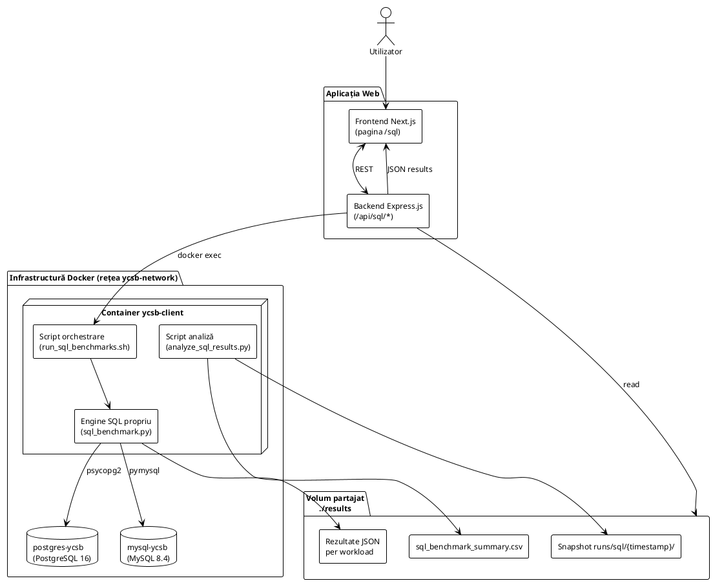
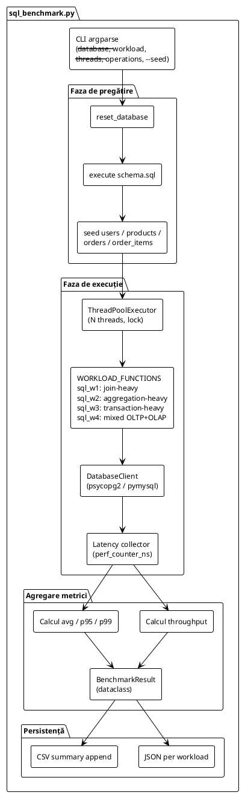
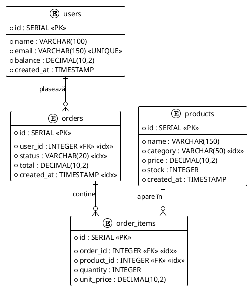

# 4.2 Implementarea experimentală a modulului SQL

Modulul SQL al aplicației dezvoltate vine ca o continuare logică a modulului YCSB, extinzând cadrul experimental dincolo de spațiul NoSQL evaluat în secțiunea 4.1. Întrucât YCSB acoperă, prin design, doar workload-uri simple de tip key–value, evaluarea bazelor de date relaționale (SQL) necesită un engine propriu, capabil să simuleze sarcini reprezentative pentru aplicații moderne — join-uri multi-tabel, agregări analitice, tranzacții ACID și combinații OLTP+OLAP — pe o schemă relațională realistă. Acest modul propune o astfel de soluție și o aplică pe două sisteme reprezentative pentru ecosistemul SQL, PostgreSQL și MySQL, în același cadru containerizat și reproductibil ca cel folosit pentru YCSB.

## 4.2.1 Obiectivele testării

Testarea experimentală a modulului SQL urmărește evaluarea comparativă a două sisteme moderne de baze de date relaționale, utilizând un engine de benchmark propriu, dezvoltat special pentru acest studiu. Obiectivele concrete ale experimentului sunt:

- **Evaluarea comparativă a două sisteme SQL reprezentative** — PostgreSQL 16 și MySQL 8.4 — sub workload-uri reprezentative pentru aplicații cloud-native, atât tranzacționale, cât și analitice;
- **Măsurarea metricilor cheie**: throughput (operații/secundă), latență medie, latența la percentila 95 (p95) și la percentila 99 (p99), toate exprimate în microsecunde, pentru a oferi vizibilitate atât asupra cazului mediu, cât și asupra cozii distribuției;
- **Evidențierea diferențelor de comportament** între un sistem orientat puternic spre OLTP, cu suport extins pentru tranzacții complexe și planificare avansată (PostgreSQL), și un sistem larg răspândit în stack-urile web tradiționale (MySQL);
- **Acoperirea a patru pattern-uri distincte de interogare** — join-heavy, aggregation-heavy, transaction-heavy și mixed OLTP+OLAP — pentru a oferi o imagine multidimensională a performanței, nu doar pe scenarii simple de citire/scriere;
- **Reproductibilitate completă** prin seed fix al generatorului de numere aleatoare, resetarea schemei înaintea fiecărui workload și parametri configurabili exclusiv prin variabile de mediu, astfel încât rezultatele să poată fi replicate în orice mediu compatibil Docker.

Scopul general al modulului SQL este de a oferi o demonstrație practică a modului în care benchmark-urile customizate pot completa instrumentele standardizate (precum YCSB) atunci când spațiul evaluat depășește capabilitățile native ale acestora, permițând astfel decizii informate la alegerea unei baze de date relaționale într-un context cloud-native.

## 4.2.2 Arhitectura aplicației

Modulul SQL respectă aceeași arhitectură pe trei niveluri descrisă pentru modulul YCSB, fiind integrat în aceeași aplicație și folosind aceeași infrastructură containerizată. Există un singur container client (`ycsb-client`) care găzduiește atât binarele YCSB, cât și engine-ul propriu de SQL, distincția dintre cele două moduri de execuție făcându-se la nivelul scripturilor de orchestrare. Componentele specifice modulului SQL sunt:

- `postgres-ycsb` — instanța PostgreSQL 16, conectată la rețeaua privată `ycsb-network`;
- `mysql-ycsb` — instanța MySQL 8.4, conectată la aceeași rețea;
- engine-ul Python propriu (`scripts/sql_benchmark.py`), executat în interiorul containerului `ycsb-client`;
- pagina dedicată din frontend (`/sql`) și endpoint-urile dedicate din backend (`/api/sql/*`).

Persistența datelor este asigurată de volume Docker dedicate (`postgres-data`, `mysql-data`), iar rezultatele experimentale sunt salvate în același volum partajat `./results` utilizat și de modulul YCSB. Această reutilizare a infrastructurii garantează că cele două module operează în condiții identice de izolare și că rezultatele lor sunt direct comparabile la nivel de mediu de execuție.

==introdu screenshot din pagina principală SQL (/sql) a aplicației ==

— aici trebuie să introduci diagrama plantuml (Fig. X — Diagrama arhitecturală a modulului SQL) —



### 4.2.2.1 Nivelul frontend

Pagina `/sql` din aplicația Next.js urmează aceeași paradigmă bazată pe componente React ca modulul YCSB, oferind utilizatorului un punct unitar de interacțiune cu modulul de testare relațional. Componenta principală `SQLResults` oferă următoarele funcționalități:

- **Configurator de grafic interactiv** — utilizatorul poate alege metrica afișată (throughput, latență medie, p95 sau p99), poate selecta dintr-o listă multiplă workload-urile pe care dorește să le compare (W1–W4) și poate comuta între reprezentarea de tip bar chart și cea de tip line chart;
- **Tabel cu rezultate brute** — afișează cele opt rânduri rezultate din combinația celor două baze de date cu cele patru workload-uri, cu toate metricile colectate (throughput, latențe avg/p95/p99, număr operații eșuate);
- **Selector de runs istorice** — un dropdown alimentat din endpoint-ul `/api/runs?module=sql` care permite revizitarea rezultatelor unor rulări anterioare, fără a pierde istoricul experimental;
- **Secțiune informativă** — un set de carduri explicative care detaliază rolul fiecărui workload în evaluare și sensul fiecărei metrici (cu indicator vizual de tip „higher is better” sau „lower is better”);
- **Indicator de câștigător per workload** — calculează automat, pe baza mediei metricii alese, care dintre cele două sisteme oferă performanța superioară pentru fiecare workload în parte.

Datele sunt prefetch-uite server-side cu React Query, iar în timpul unei rulări active frontend-ul interoghează periodic endpoint-ul de status pentru a afișa un indicator de progres granular fără a necesita websocket-uri.

==introdu screenshot din dashboard-ul modulului SQL cu graficul de throughput ==

==introdu screenshot din tabelul cu rezultate brute (2 DB × 4 workload-uri) ==

==introdu screenshot din secțiunea informativă cu cardurile descriptive ale workload-urilor W1–W4 ==

### 4.2.2.2 Serviciul backend

Serviciul backend pentru modulul SQL este implementat ca o componentă specializată în cadrul aceleiași aplicații Express.js care deservește și modulul YCSB. Acesta expune trei endpoint-uri principale care acoperă întreg ciclul de viață al unei sesiuni de testare:

- `POST /api/sql/benchmark/start` — declanșează execuția engine-ului SQL prin invocarea scriptului `run_sql_benchmarks.sh` în containerul `ycsb-client`, printr-un apel `docker compose exec`;
- `GET /api/sql/benchmark/status` — returnează starea curentă a rulării: progres (0–100%), baza de date curentă, workload-ul curent, mesajul de stare și lista workload-urilor finalizate;
- `GET /api/sql/results?runId=<id>` — încarcă rezultatele agregate dintr-o rulare istorică, alimentate din fișierul `sql_benchmark_summary.csv` sau din snapshot-urile timestamped.

Stratul de orchestrare urmează aceeași strategie indirectă ca modulul YCSB: backend-ul nu rulează direct codul de benchmark, ci delegă execuția unui proces separat în containerul `ycsb-client`. Stdout-ul scriptului este parsat în timp real cu expresii regulate, pentru a actualiza obiectul global de status fără overhead-ul unei conexiuni persistente:

- pattern-urile `PHASE 1: PostgreSQL` și `PHASE 2: MySQL` declanșează schimbarea bazei de date curente și ajustarea progresului (0–50% pentru PostgreSQL, 50–100% pentru MySQL);
- pattern-ul `Running workload (sql_w[1-4])` setează workload-ul curent în obiectul de status;
- pattern-urile `completed successfully` și `completed with warnings` marchează finalizarea unui workload și permit incrementarea pasului de progres.

Această abordare permite frontend-ului să afișeze un indicator de progres granular prin simple apeluri REST periodice, păstrând o arhitectură backend simplă, fără dependențe suplimentare de socket-uri sau evenimente push.

### 4.2.2.3 Engine-ul propriu de benchmark SQL

Spre deosebire de modulul YCSB, care utilizează binarele oficiale Yahoo! Cloud Serving Benchmark pentru evaluarea bazelor de date NoSQL, modulul SQL folosește un engine propriu, scris integral în Python 3, dezvoltat special pentru evaluarea bazelor de date relaționale. Motivația acestei alegeri este următoarea:

- **YCSB acoperă doar workload-uri simple key–value**, care nu permit evaluarea capacităților relaționale relevante (planificarea join-urilor pe mai multe tabele, agregări analitice, suportul tranzacțional ACID);
- **Benchmark-urile clasice (TPC-C, TPC-H, TPC-E) sunt fie excesiv de complexe** pentru un studiu de caz academic într-o aplicație unitară, fie au cerințe de licență și setup care le scot din spațiul cloud-native, modular și reproductibil urmărit de această lucrare;
- **Un engine propriu oferă control total** asupra schemei, a parametrilor experimentali și a modului în care metricile sunt colectate, păstrând în același timp metodologia inspirată din YCSB (faze separate de pregătire și de măsurare, calcul de percentile pentru latențe, throughput sustained).

Engine-ul este implementat ca un singur script `sql_benchmark.py`, parametrizat prin argumente CLI, și se compune din următoarele componente principale:

- **Clasa `DatabaseClient`** — abstractizează conexiunea către cele două baze de date, oferind o interfață unificată peste cele două drivere Python: `psycopg2-binary` pentru PostgreSQL și `pymysql` pentru MySQL. Tratează la runtime diferențele de dialect SQL (de exemplu, `RANDOM()` în PostgreSQL vs. `RAND()` în MySQL, sau folosirea clauzei `RETURNING` vs. obținerea ID-ului ultimei inserții);
- **Dicționarul `WORKLOAD_FUNCTIONS`** — mapează etichetele `sql_w1`...`sql_w4` la funcțiile Python care implementează fiecare workload în parte. Acest design face engine-ul ușor extensibil: adăugarea unui nou workload se rezumă la implementarea unei funcții și înregistrarea ei în dicționar;
- **Faza de pregătire** — resetează schema bazei de date, execută scriptul `schema.sql`, apoi populează tabelele cu date de seed (utilizatori, produse, comenzi, linii de comandă), folosind un generator de numere pseudo-aleatoare cu seed fix pentru reproductibilitate;
- **Faza de măsurare** — pornește un grup de thread-uri Python (implicit 8), fiecare thread executând în buclă funcția workload-ului ales până la atingerea cotei totale de operații. Numărul de thread-uri și numărul de operații sunt configurabile prin variabile de mediu;
- **Colectorul de metrici** — folosește `time.perf_counter_ns()` pentru cronometrare cu precizie nanosecundă, agregează latențele per thread folosind un `threading.Lock()`, iar la final calculează media, p95 și p99 din lista ordonată de latențe. Throughput-ul se obține ca raport între numărul total de operații reușite și durata wall-clock a fazei de măsurare;
- **Serializer-ul de rezultate** — produce o instanță `BenchmarkResult` (un `dataclass` cu 12 câmpuri: baza de date, eticheta workload-ului, descrierea, throughput-ul, latențele avg/p95/p99, operațiile cerute, reușite și eșuate, numărul de thread-uri și seed-ul folosit) și o scrie atât ca fișier JSON per workload, cât și ca rând în fișierul CSV de sumar.

— aici trebuie să introduci diagrama plantuml (Fig. X — Arhitectura internă a engine-ului SQL propriu) —



### 4.2.2.4 Schema relațională comună

Cele două baze de date evaluate utilizează aceeași schemă relațională, definită într-un fișier SQL portabil (`schema.sql`) și aplicată identic pe ambele sisteme. Schema simulează un mini-domeniu de e-commerce, suficient de bogat pentru a permite workload-uri OLTP și OLAP realiste, dar suficient de compact pentru a rămâne ușor de înțeles. Conține patru tabele cu relații prin chei externe și indexuri pe coloanele cele mai des accesate:

- **`users`** — utilizatori ai platformei (id, name, email cu constrângere UNIQUE, balance, created_at);
- **`products`** — produsele disponibile la vânzare (id, name, category, price, stock, created_at);
- **`orders`** — comenzile plasate (id, user_id ca cheie externă către `users`, status, total, created_at);
- **`order_items`** — liniile fiecărei comenzi (id, order_id către `orders`, product_id către `products`, quantity, unit_price).

În plus față de cheile primare și externe, sunt definite nouă indexuri secundare pe coloane folosite intens de workload-uri (`idx_orders_user_id`, `idx_orders_created_at`, `idx_order_items_order_id`, `idx_products_category` ș.a.), pentru a permite planificatorului SQL să aleagă strategii eficiente de execuție pentru fiecare tip de interogare.

— aici trebuie să introduci diagrama plantuml (Fig. X — Diagrama ER a schemei utilizate de modulul SQL) —



## 4.2.3 Setup-ul experimental

Containerele de baze de date pentru modulul SQL sunt definite în același fișier `docker-compose.yml` ca cele pentru modulul YCSB, conectate la aceeași rețea privată `ycsb-network` de tip bridge. Această reutilizare a infrastructurii garantează că ambele module operează în condiții identice și că nu există interferențe nedorite între cele patru baze de date evaluate. Pașii realizării setup-ului sunt similari cu cei descriși la secțiunea 4.1.3:

**1. Definirea serviciilor.** În `docker-compose.yml` sunt adăugate două servicii noi:

- `postgres` — imaginea oficială `postgres:16`, container numit `postgres-ycsb`, port standard 5432 expus pe gazdă, volum dedicat `postgres-data` pentru persistența datelor;
- `mysql` — imaginea oficială `mysql:8.4`, container numit `mysql-ycsb`, port standard 3306 expus pe gazdă, volum dedicat `mysql-data` pentru persistența datelor.

Ambele servicii sunt inițializate cu aceleași credențiale (utilizator `ycsb`, parolă `ycsb`, bază de date `ycsb`), pentru a simplifica scripturile de orchestrare și a evita configurări specifice fiecărui sistem.

**2. Pornirea serviciilor.** După asigurarea faptului că aplicația Docker este activă pe sistemul gazdă, toate cele patru baze de date plus containerul client se pornesc în fundal cu o singură comandă:

```bash
docker compose up -d
```

**3. Verificarea conexiunii.** Pentru a confirma că serviciile rulează corect și acceptă conexiuni, se execută:

```bash
docker exec -it postgres-ycsb psql -U ycsb -d ycsb -c "SELECT version();"
docker exec -it mysql-ycsb mysql -uycsb -pycsb ycsb -e "SELECT VERSION();"
```

Output-ul așteptat este versiunea sistemului interogat (16.x pentru PostgreSQL, respectiv 8.4.x pentru MySQL).

**4. Parametrii experimentali.** Pentru a permite ajustarea volumului de date și a nivelului de concurență fără a modifica codul, toți parametrii cheie sunt expuși ca variabile de mediu în scriptul `run_sql_benchmarks.sh`:

| Parametru | Variabilă de mediu | Valoare implicită | Rol |
|---|---|---|---|
| Număr utilizatori (seed) | `SQL_USERS` | 10.000 | rânduri populate în tabela `users` |
| Număr produse (seed) | `SQL_PRODUCTS` | 1.000 | rânduri populate în tabela `products` |
| Număr comenzi (seed) | `SQL_ORDERS` | 10.000 | rânduri populate în tabela `orders` |
| Operații per workload | `SQL_OPERATION_COUNT` | 2.000 | volumul măsurat în faza de execuție |
| Thread-uri concurente | `SQL_THREADS` | 8 | nivelul de paralelism al clientului |
| Seed PRNG | `--seed` | 42 | reproductibilitatea operațiilor random |

În urma acestor pași, infrastructura SQL este configurată și pregătită pentru rularea benchmark-urilor, oferind un mediu controlat și reproductibil pentru secțiunea următoare.

==introdu screenshot din terminal cu execuția scriptului run_sql_benchmarks.sh ==

## 4.2.4 Workload-urile SQL

Spre deosebire de YCSB, unde workload-urile A–F sunt definite prin fișiere `.properties` care exprimă raporturi între operații de tip read, update și scan, workload-urile modulului SQL sunt **funcții Python distincte**, fiecare având un profil specific de interogări reprezentativ pentru un tip de sarcină din lumea reală. Această abordare permite exprimarea unor scenarii complexe (tranzacții multi-statement, agregări analitice cu `GROUP BY`, join-uri pe mai multe tabele) care nu pot fi modelate doar prin raporturi simple de operații.

Au fost definite patru workload-uri, fiecare evaluând o dimensiune diferită a performanței SQL:

**Workload SQL-W1 — Join-heavy.** Execută în mod repetat interogări multi-join pe patru tabele: pentru un identificator de comandă ales aleator, recuperează detaliile complete ale comenzii (numele utilizatorului care a plasat-o, produsele incluse, cantitățile și prețurile). Acest workload testează calitatea planificatorului de join-uri și eficiența căutărilor prin chei primare și externe, precum și capacitatea sistemului de a folosi indexurile potrivite în lanțul de join-uri.

**Workload SQL-W2 — Aggregation-heavy.** Este un mix ponderat: 80% interogări analitice de tip `GROUP BY` pe categoriile de produse, cu funcții de agregare `SUM` și `COUNT` aplicate pe volumul de vânzări, și 20% inserări de comenzi noi. Acest workload testează costul scanărilor și al operațiilor de reducere pe seturi mari de date, evidențiind diferențele dintre cele două sisteme în ceea ce privește optimizarea agregărilor.

**Workload SQL-W3 — Transaction-heavy.** Execută tranzacții multi-statement cu actualizări de stoc, validare și commit sau rollback. Fluxul unei tranzacții este: selecția unui produs cu stoc disponibil, decrementarea stocului, inserarea unei linii de comandă, finalizarea tranzacției. În cazul în care apare o eroare (de exemplu, stoc insuficient după un acces concurent), tranzacția este derulată înapoi. Acest workload testează overhead-ul mecanismelor tranzacționale și comportamentul sistemului sub conflict de scriere.

**Workload SQL-W4 — Mixed OLTP + OLAP.** Combinație ponderată a celorlalte trei: 55% join-uri (similare cu W1), 25% agregări (similare cu W2) și 20% tranzacții (similare cu W3). Simulează un sistem real care servește simultan trafic operațional (citiri și scrieri rapide) și trafic analitic (rapoarte agregate), oferind o imagine de ansamblu asupra capacității sistemului de a echilibra cele două tipuri de sarcini.

==introdu screenshot din pagina /sql cu cardurile descriptive ale workload-urilor W1–W4 ==

## 4.2.5 Configurarea engine-ului și fluxul complet al execuției

Scriptul `run_sql_benchmarks.sh`, executat în interiorul containerului `ycsb-client`, automatizează întregul flux experimental pentru ambele baze de date, eliminând necesitatea unor intervenții manuale între workload-uri. Fluxul de execuție este următorul:

1. **Așteptarea inițializării.** Scriptul verifică, prin utilitarul `nc` (netcat), disponibilitatea porturilor 5432 (PostgreSQL) și 3306 (MySQL). Această buclă de polling este identică cu cea folosită pentru Redis/MongoDB în modulul YCSB și garantează că engine-ul nu pornește înainte ca bazele de date să accepte conexiuni.
2. **Citirea parametrilor.** Toți parametrii experimentali enumerați în secțiunea 4.2.3 sunt preluați din variabilele de mediu, cu valori implicite în cazul în care nu sunt setate explicit.
3. **Faza 1 — PostgreSQL.** Pentru fiecare dintre cele patru workload-uri (`sql_w1` ... `sql_w4`), scriptul invocă engine-ul Python cu parametrii corespunzători. Engine-ul resetează schema, populează datele de seed, execută faza de măsurare cu numărul configurat de thread-uri și salvează rezultatele în `/ycsb/results/sql/postgres/sql_w{N}.json`, alături de logul brut în fișierul corespunzător `run_sql_w{N}.txt`.
4. **Pauză de stabilizare.** Între cele două faze este introdusă o pauză de 10 secunde, care permite stabilizarea resurselor sistemului gazdă (memorie cache, conexiuni nete) înainte de începerea testelor pe MySQL.
5. **Faza 2 — MySQL.** Aceeași secvență este reluată pentru MySQL, cu output în `/ycsb/results/sql/mysql/`.
6. **Agregarea rezultatelor.** Scriptul `analyze_sql_results.py` consolidează cele opt fișiere JSON (2 baze de date × 4 workload-uri) într-un fișier CSV unic `sql_benchmark_summary.csv` și creează un snapshot timestamped în `results/runs/sql/{ISO-timestamp}/`, care păstrează un istoric complet al rulării pentru audit și pentru comparații longitudinale.

**Fluxul end-to-end văzut de utilizator** se desfășoară secvențial și controlat, oferind vizibilitate completă asupra fiecărei etape:

- utilizatorul declanșează rularea din pagina `/sql` a aplicației, prin butonul „Start SQL Benchmark”;
- frontend-ul trimite o cerere către endpoint-ul `POST /api/sql/benchmark/start`;
- backend-ul lansează `run_sql_benchmarks.sh` în containerul `ycsb-client` printr-un apel `docker compose exec`;
- în timpul execuției, frontend-ul interoghează periodic `GET /api/sql/benchmark/status` și afișează un indicator de progres granular, evidențiind faza curentă, baza de date curentă și workload-ul curent;
- la finalizare, fișierele JSON și CSV sunt disponibile în volumul partajat `./results`, iar snapshot-ul rulării este arhivat în directorul de runs istorice;
- frontend-ul interoghează `GET /api/sql/results` pentru a obține datele structurate și afișează grafice comparative, tabel cu rezultate brute și indicator automat de câștigător per workload.

==introdu screenshot din pagina /sql în timpul unei rulări active, cu indicator de progres ==

==introdu screenshot din selectorul de runs istorice ==

**Considerații de reproductibilitate.** Mai mulți factori contribuie la asigurarea unor rezultate reproductibile între rulări:

- **seed-ul fix** (implicit 42) garantează că generatorul de numere aleatoare produce aceleași secvențe de operații în rulări consecutive;
- **resetarea completă a schemei** înainte de fiecare workload elimină contaminarea cu date reziduale și asigură că fiecare test pornește dintr-o stare cunoscută;
- **snapshot-urile timestamped** (`results/runs/sql/{timestamp}/`) păstrează istoric complet al rulărilor, permițând atât audit-ul rezultatelor, cât și comparații în timp asupra performanței aceluiași sistem după modificări de configurare sau de versiune;
- **parametrii expuși ca variabile de mediu** permit replicarea exactă a unei rulări într-un alt context, fără modificări de cod sursă.

Această automatizare end-to-end transformă procesul de evaluare a bazelor de date relaționale într-un flux de tip „one-click”: utilizatorul declanșează rularea dintr-o singură interacțiune, iar rezultatele complete — incluzând atât metricile brute, cât și vizualizările comparative — devin disponibile la finalul execuției, fără intervenții manuale suplimentare.
